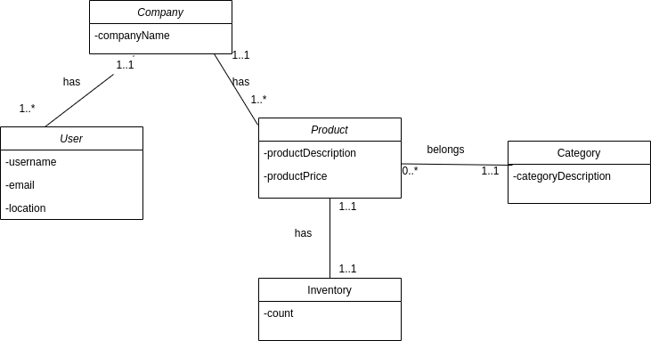
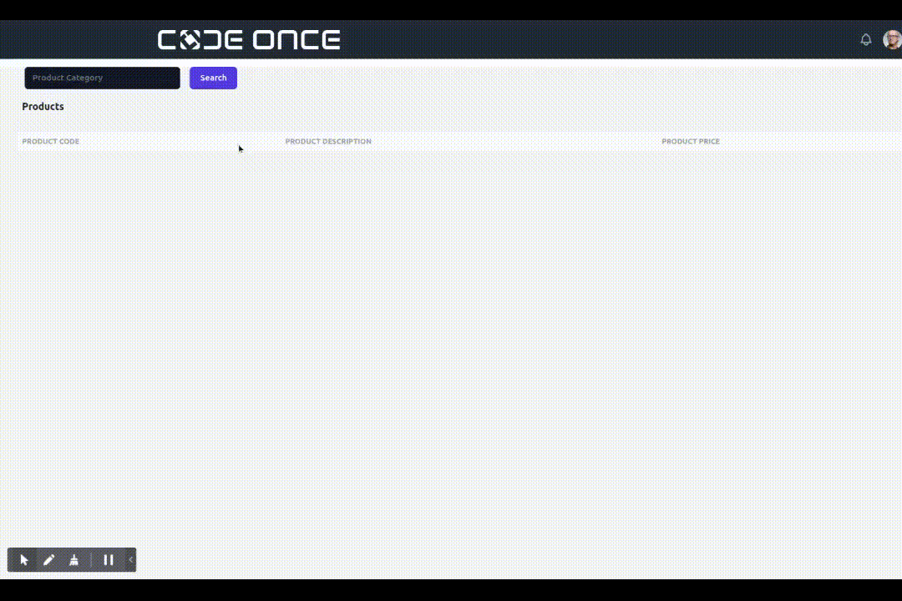

# inventory

## Introduction

**inventory** allows a user (belongs to a company) to return the available products that have inventory quantity > 0 by entering the category of the products.

## Used Technologies

### Backend :

Maven 3.6.3 , Spring boot 2.6.3, Spring Data, Spring REST

### Database :

MySQL

### Frontend :

React

## UML class diagram of the program:

## Testing

I used JUnit 5 and mockito.

## Demo

